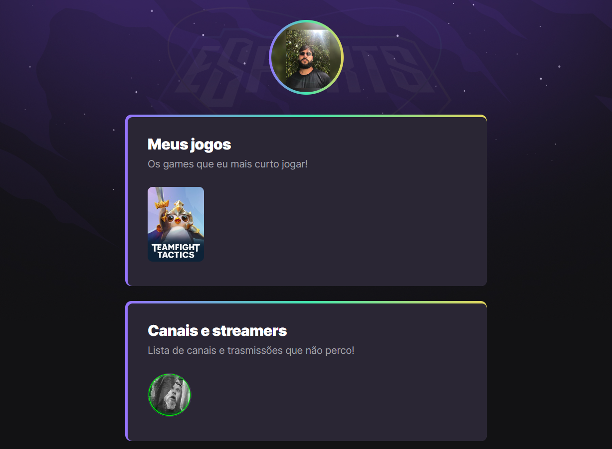

# NLW eSports 

>Trilha Explorer

Projeto construído no evento Next Level Week da Rocketseat.

[🔗 Clique aqui para acessar](https://ismaelcaetano.github.io/Nlw-esports-explorer/)

## 🧑‍💻 Tecnologias 

- HTML
- CSS
- Git e Github
## 📚 O que aprendi
Nessa semana eu reforcei os conceitos básicos do HTML, eu aprendi a trabalhar a estética do site com o CSS, como criar uma borda em gradiente e o que mais me surpreendeu foi a animação que fizemos no site.

## 📧 Conteúdo
dev.ismael.c.caetano@gmail.com